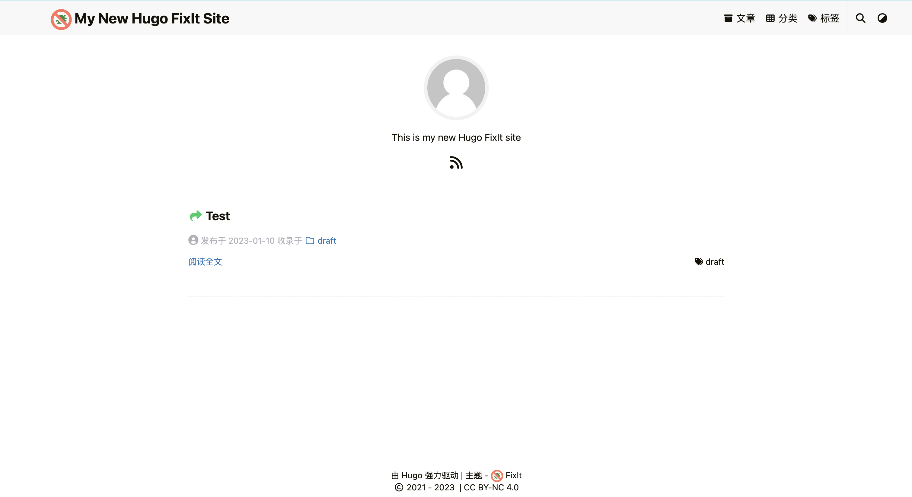
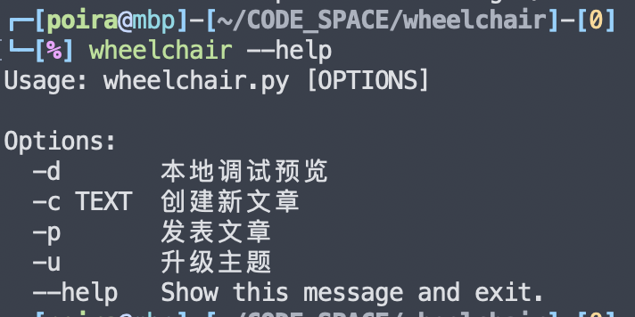

# 从 Hexo 到 Hugo


从 Hexo 迁移到 Hugo

&lt;!--more--&gt;

### 前言

自茯苓我从 Windows 投向 Macos 的怀抱以后，真是有好多东西要做迁移，加上 M1 架构的生态并不是那么好，茯苓的迁移进程就慢到起飞。本来打算这两天写一篇博客，这才意识到，之前的 hexo 博客没做迁移，以前一直就听说 hugo 优点很多，干脆心一横，枪在手，跟我走，杀 hexo，抢 hugo！

### 安装

##### 安装 Hugo

Mac 直接使用 brew 安装即可

```shell
brew install hugo
```

##### 生成站点

生成博客文件夹

```shell
hugo new site Bitter_Tree/Blog
```

先 cd 到博客文件夹，后续操作都在博客文件夹下

##### 安装皮肤

茯苓这里选取的是 [FixIt](https://github.com/hugo-fixit/FixIt) 主题，集大成者

```shell
git init
git submodule add https://github.com/hugo-fixit/FixIt.git themes/FixIt
```

##### 创建页面

填写网站根目录的配置文件 config.toml

```toml
title = &#34;我的全新 Hugo FixIt 网站&#34;
baseURL = &#34;http://example.org/&#34;
# 设置默认的语言 [&#34;en&#34;, &#34;zh-cn&#34;, &#34;fr&#34;, &#34;pl&#34;, ...]
defaultContentLanguage = &#34;zh-cn&#34;
# 网站语言, 仅在这里 CN 大写 [&#34;en&#34;, &#34;zh-CN&#34;, &#34;fr&#34;, &#34;pl&#34;, ...]
languageCode = &#34;zh-CN&#34;
# 是否包括中日韩文字
hasCJKLanguage = true

# 更改使用 Hugo 构建网站时使用的默认主题
theme = &#34;FixIt&#34;

[params]
  # FixIt 主题版本
  version = &#34;0.2.X&#34;

[menu]
  [[menu.main]]
    identifier = &#34;posts&#34;
    # 你可以在名称（允许 HTML 格式）之前添加其他信息，例如图标
    pre = &#34;&#34;
    # 你可以在名称（允许 HTML 格式）之后添加其他信息，例如图标
    post = &#34;&#34;
    name = &#34;文章&#34;
    url = &#34;/posts/&#34;
    # 当你将鼠标悬停在此菜单链接上时，将显示的标题
    title = &#34;&#34;
    weight = 1
    # 向菜单项添加用户定义的内容
    [menu.main.params]
      # 添加 CSS 类到菜单项
      class = &#34;&#34;
      # 是否为草稿菜单，类似草稿页面
      draft = false
      # 添加 fontawesome 图标到菜单项
      icon = &#34;fa-solid fa-archive&#34;
      # 设置菜单项类型，可选值：[&#34;mobile&#34;, &#34;desktop&#34;]
      type = &#34;&#34;
  [[menu.main]]
    identifier = &#34;categories&#34;
    pre = &#34;&#34;
    post = &#34;&#34;
    name = &#34;分类&#34;
    url = &#34;/categories/&#34;
    title = &#34;&#34;
    weight = 2
    [menu.main.params]
      icon = &#34;fa-solid fa-th&#34;
  [[menu.main]]
    identifier = &#34;tags&#34;
    pre = &#34;&#34;
    post = &#34;&#34;
    name = &#34;标签&#34;
    url = &#34;/tags/&#34;
    title = &#34;&#34;
    weight = 3
    [menu.main.params]
      icon = &#34;fa-solid fa-tags&#34;

# Hugo 解析文档的配置
[markup]
  # 语法高亮设置 (https://gohugo.io/content-management/syntax-highlighting)
  [markup.highlight]
    # false 是必要的设置 (https://github.com/hugo-fixit/FixIt/issues/43)
    noClasses = false
```

创建一个关于页面和文章页面

```shell
hugo new posts/test.md
```

启动 Hugo

```shell
hugo server -D
```

就会在本地启动博客了



### 配置

##### 网站基础配置

https://fixit.lruihao.cn/zh-cn/theme-documentation-basics/#site-configuration 这里有详细的配置，参照这个配置文件做改动

茯苓的建议是把他的配置文件直接复制到博客根目录下，不要去主题文件夹里面修改

这步茯苓主要是做一些网站图片，网站名称的修改，值得一提的是该主题本身就有关于和友链页面，可以直接创建并修改菜单栏

##### 魔改 css

目前这个主题还未提供更换背景的功能，只能自己魔改了

首先在网站根目录下创建 assets/css 文件夹，在里面添加 _custom.scss

```css
body {
    background-image: url(/background.jpg);
    background-size: cover;
    background-position: top 20px center;
    background-repeat: no-repeat;
    background-attachment: fixed;
}

header#header-desktop.desktop.animate__faster {
    backdrop-filter: blur(10px);
    background: hsla(0, 0%, 100%, 0.8) linear-gradient(90deg, rgba(247,149,51,0.15) 0, rgba(243,112,85,0.15) 15%, rgba(239,78,123,0.15) 30%, rgba(161,102,171,0.15) 44%, rgba(80,115,184,0.15) 58%, rgba(16,152,173,0.15) 72%, rgba(7,179,155,0.15) 86%, rgba(109,186,130,0.15) 100%);
    [data-theme=&#39;dark&#39;] &amp; {
        background-color: $header-background-color-dark;   
    }
}

main.container, footer.footer {
    background-color: rgba($color: $global-background-color, $alpha: 0.45);
    [data-theme=&#39;dark&#39;] &amp; {
        background-color: rgba($color: $global-background-color-dark, $alpha: 0.9);   
    }
}
```

这是茯苓的配置，对黑夜效果也做了适配，效果图为


##### 添加评论系统

茯苓货比三家最后选择了 Waline 评论系统，可以参照[官方文档](https://waline.js.org/guide/get-started/)配置，非常详细，记得配置评论提醒功能哦

这里贴一下 config

```toml
      [params.page.comment.waline]
        enable = true
        serverURL = &#34;&#34;
        pageview = true # FixIt 0.2.15 | 新增
        emoji = [&#34;//unpkg.com/@waline/emojis@1.1.0/weibo&#34;]
        meta = [&#34;nick&#34;, &#34;mail&#34;, &#34;link&#34;]
        requiredMeta = [&#34;nick&#34;, &#34;mail&#34;]
        login = &#34;enable&#34;
        wordLimit = 0
        pageSize = 10
        imageUploader = true # FixIt 0.2.15 | 新增
        highlighter = true # FixIt 0.2.15 | 新增
        comment = true # FixIt 0.2.15 | 新增
        texRenderer = true # FixIt 0.2.16 | 新增
        search = true # FixIt 0.2.16 | 新增
        recaptchaV3Key = &#34;&#34; # FixIt 0.2.16 | 新增
```

##### 修改 fontawesome

茯苓根据自己的情况，创建了一个 fontawesome 模版，放在博客根目录的 archetypes 文件夹下，建一个 posts.md

```yaml
title: &#34;{{ replace .TranslationBaseName &#34;-&#34; &#34; &#34; | title }}&#34;
date: {{ .Date }}
Lastmod:
password:
message: &#34;此地无银三百两&#34;
comment: true
weight: 0

categories:
- draft

resources:
- name: featured-image
  src: featured-image.png
```

##### 文章迁移

茯苓以前也都不怎么写博客，有很多文章的年限都比较久了，就挑了一篇二次反序列化，以及 JavaSE 的笔记迁过来，要改动的地方就是头部的那些，没啥难度就是有点麻烦耗时间

##### 部署到 github 仓库

需要部署在 GitHub Pages 上，首先在GitHub上创建一个 Repository，仓库名必须跟自己的用户名一样`用户名.github.io`

然后运行`hugo`命令创建 public 页面，然后建立本地和 github 仓库的连接

```bash
hugo
cd public
git init
git add .
git commit -m &#34;updating site on $(date)&#34;
git remote add origin https://github.com/PoriaMs/poriams.github.io.git
git push -u origin main
```

与远程仓库建立连接时，现在不能使用用户名密码登录，需要申请令牌，会有提示文档，照着操作就好

以后每次更新只需要

```bash
hugo
cd public
git add .
git commit -m &#34;updating site on $(date)&#34;
git push origin main
```

##### 添加 google 分析

添加这个可以帮助茯苓统计网站流量

申请好 ID 之后填上去即可

```toml
  [params.analytics]
    enable = true
    # Google Analytics
    [params.analytics.google]
      id = &#34;&#34;
      # 是否匿名化用户 IP
      anonymizeIP = true
```

##### 添加 SEO

###### Google

第一步

先去 https://search.google.com/search-console 点击添加资源，选择 URL 方式导入，输入 URL，然后下载弹出 html 到 static 目录下，重新部署网站，部署完之后点击验证，验证成功代表没问题

第二步

在 search-console 中点击站点地图，然后把自己的添加进去，hugo 的默认在 sitemap.xml 下

###### 百度

进入[百度搜索资源平台](https://ziyuan.baidu.com/)，选择 用户中心-&gt;站点管理-&gt;添加网站，这里的验证方式也可以选择下载html的方式，步骤和google的一样，验证成功后选择 搜索服务-&gt;普通收录-&gt;sitemap，输入sitemap的网址，和google的站点地图一样。不过百度的收录速度貌似很慢

###### 必应

进入[Bing Webmaster Tools](https://www.bing.com/webmasters)，登录后直接导入google的数据就可以，很方便

##### 辅助脚本

茯苓迎合自己的需求写了一个博客辅助脚本，生成文章时可以按照文章名生成文件夹，以 index.md 为文章内容，图片就可以保存在文件夹内以相对路径引用了，还有一些其他功能方便自己使用



地址：https://github.com/PoriaMs/wheelchair


---

> 作者:   
> URL: https://poriams.github.io/%E4%BB%8E-hexo-%E5%88%B0-hugo/  

