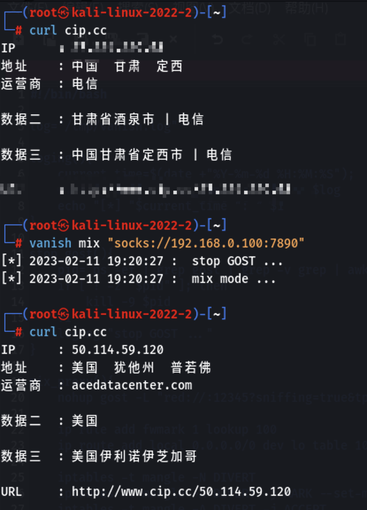
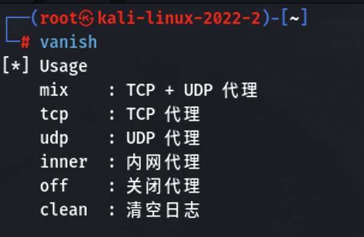
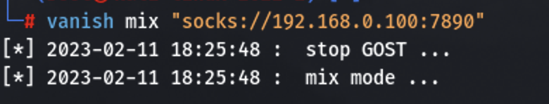
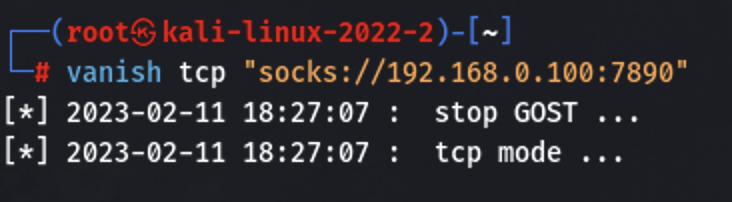
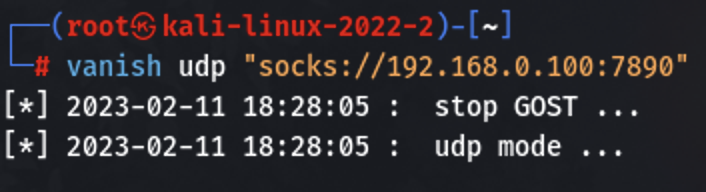
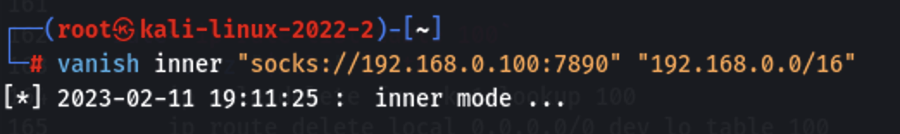
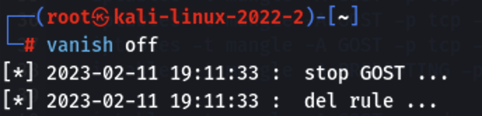

# 对 Linux 全局代理的探索


<!--more-->

Linux 全局代理脚本

### 前言

众所周知，我们在网上“探索”别人网站的时候，通常都需要挂上代理来隐藏自己。茯苓目前的方案是这样的，物理机用作 CTF 等日常的使用；开第一个虚拟机用来进行渗透行为，受限于一些条件，茯苓目前只能用 Kali 来渗透；开第二个虚拟机用来进行调试网上拉下来的代码以及运行一些不确定安全性的软件。茯苓给这组方案起名为**面具系统**，以后有机会详细描述下配置的具体细节。（又挖一个坑）

对于 Windows 和 MacOS 用户，我们可以使用 [Proxifier](https://www.proxifier.com/) 来实现进程级的代理，好用程度，谁用谁知道。但是 Linux 用户就没用这么好的运气了，而网上几乎很难找到靠谱的方案，现在开始讲述茯苓的探索血泪史。

### 最常见的 proxychains

茯苓打开浏览器一搜索“Linux 全局代理”，大多数都是这种方案。都是清一色的给浏览器设置代理，然后对于工具，都在命令行里面使用 proxychains 作为前缀来套一层代理，网上全是这种，茯苓这里就不再赘述。这种方式确实能解决一些问题，但是用起来极其不方便。

### 倾旋大佬的透明代理方式

就在某一个月黑风高的夜晚，茯苓突然搜到了一个链接[Linux透明代理在红队渗透中的应用](https://payloads.online/archivers/2020-11-13/1/)，我终于看到了一些曙光。

详细的内容可以看链接，这里茯苓简单介绍一下几个关键点。

##### iptables

iptables 是 Linux 管理员用来设置 IPv4 数据包过滤条件和 NAT 的命令行工具。可以设置规则轻松地重定向传入流量，实现将流量导入 socks 代理。

##### redsocks

redsocks 是一个能够重定向socks代理的一款开源软件，它允许我们在系统上监听一个端口，与远程socks端口进行转换，并且支持socks5认证。

##### 透明代理

透明代理的意思是客户端根本不需要知道有代理服务器的存在，它改变你的 request fields（报文），并会传送真实 IP，多用于路由器的 NAT 转发中。加密的透明代理则是属于匿名代理。

那么总结一下来说就是，利用 iptables 重定向流量到一个端口，利用 redsocks 将该端口流量转化为 socks 代理即我们的代理，这样就可以形成一种透明代理。我们的 linux 访问网站时，会被防火墙拦截，然后通过代理发送到目标网站。对于 linux 系统来说，它以为自己是直接访问了目标网站，而不知道被代理了。

在学习了他的脚本以后，茯苓往顺手修改了一下，

```shell
#!/bin/bash

# redsocks 配置
redsocks_bin_path="redsocks"
redsocks_config_file_path="/etc/redsocks.conf"
shell_log_path="/tmp/socks-switch.log"

# 代理配置
sed_tool(){
    sed -i $1'd' $redsocks_config_file_path
    sed -i $1"i\        $2" $redsocks_config_file_path
}
set_proxy(){
    # 行号 内容
    # type
    sed_tool '52' 'type = socks5;'
    # ip
    sed_tool '47' 'ip = 10.37.129.2'
    # port
    sed_tool '48' 'port = 7890'
    socks_loging "set proxy ..."
}

# 记录日志
socks_loging(){
    current_time=$(date +"%Y-%m-%d %H:%M:%S");
    echo "[*] "$current_time ": " $1 >> $shell_log_path
    echo "[*] "$current_time ": " $1
}

# 开启 redsocks
start_redsocks(){
    $redsocks_bin_path -c $redsocks_config_file_path
    socks_loging "start redsocks ..."
}

# 关闭 redsocks
stop_redsocks(){
    pkill redsocks
    socks_loging "stop redsocks ..."
}

# 重置 iptalbes 不影响其他规则
reset_iptables(){
    ids=`iptables -t nat -nL OUTPUT --line-number | grep REDSOCKS | awk '{print $1}'`
    if [ ! -z "$ids" ]; then
        id_array=(${ids//\\n/ })
    	#socks_loging "REDSOCKS OUTPUT Chian ID : $id_array"
    	for id in ${id_array[@]}
    	do
        	id=`echo $id|egrep -o "[0-9]{1,4}"`
        	if [ $id != "" ]; then
            		iptables -t nat -D OUTPUT $id
            		#iptables -t nat -D PREROUTING $id
        	fi
    	done
    fi
    #socks_loging "No Set Iptables ..."
    
    iptables -t nat -nvL REDSOCKS > /dev/null 2>&1
    if [ "$?" != "1" ]; then
            iptables -t nat -F REDSOCKS
            iptables -t nat -X REDSOCKS
    fi
    socks_loging "reset iptables ..."
}

# 清除全部 iptables
clean(){
    iptables -t nat -F
    iptables -t nat -X
    iptables -t nat -P PREROUTING ACCEPT
    iptables -t nat -P POSTROUTING ACCEPT
    iptables -t nat -P OUTPUT ACCEPT
    iptables -t mangle -F
    iptables -t mangle -X
    iptables -t mangle -P PREROUTING ACCEPT
    iptables -t mangle -P INPUT ACCEPT
    iptables -t mangle -P FORWARD ACCEPT
    iptables -t mangle -P OUTPUT ACCEPT
    iptables -t mangle -P POSTROUTING ACCEPT
    iptables -F
    iptables -X
    iptables -P FORWARD ACCEPT
    iptables -P INPUT ACCEPT
    iptables -P OUTPUT ACCEPT
    iptables -t raw -F
    iptables -t raw -X
    iptables -t raw -P PREROUTING ACCEPT
    iptables -t raw -P OUTPUT ACCEPT
    socks_loging "clean iptables ..."
}

# 浏览模式
browse(){
    iptables -t nat -A REDSOCKS -d 10.0.0.0/8 -j RETURN
    iptables -t nat -A REDSOCKS -d 127.0.0.0/8 -j RETURN
    iptables -t nat -A REDSOCKS -d 169.254.0.0/16 -j RETURN
    iptables -t nat -A REDSOCKS -d 172.16.0.0/12 -j RETURN
    iptables -t nat -A REDSOCKS -d 192.168.0.0/16 -j RETURN
    iptables -t nat -A REDSOCKS -p tcp -j REDIRECT --to-port 12345
    socks_loging "browse mode ..."
}

# 内网模式
intranet(){
    set_proxy
    iptables -t nat -A REDSOCKS -p tcp -d 10.0.0.0/8 -j REDIRECT --to-port 12345
    iptables -t nat -A REDSOCKS -p tcp -d 172.0.0.0/8 -j REDIRECT --to-port 12345
    iptables -t nat -A REDSOCKS -p tcp -d 192.168.0.0/16 -j REDIRECT --to-port 12345
    socks_loging "intranet mode ..."
}

# 自定义模式
diy(){
    socks_loging "diy mode ..."
}

# 载入防火墙
install(){
    stop_redsocks
    reset_iptables
    iptables -t nat -N REDSOCKS
    iptables -t nat -A REDSOCKS -d $proxy_ip -j RETURN
    
    if [ "$1" = "browse" ]; then
        browse
    fi

    if [ "$1" = "intranet" ]; then
        intranet
    fi

    if [ "$1" = "diy" ]; then
        diy
    fi

    iptables -t nat -A OUTPUT -p tcp -m owner ! --uid-owner $redsocks_user  -j REDSOCKS
    start_redsocks
}

# banner
if [ -z "$1" ]; then
    echo "[*] Usage
    proxy    : 配置代理
    browse   : 浏览模式
    intranet : 内网模式
    diy      : 自定义模式
    reset    : 重制 iptables 不影响其他规则
    clean    : 清空 iptables 所有规则
    stop     : 重制 iptables 并关闭代理
    "
    exit 0
fi


if [ "$1" = "proxy" ]; then
    set_proxy
    exit 0
fi

if [ "$1" = "browse" ]; then
    install $1
    exit 0
fi

if [ "$1" = "intranet" ]; then
    install $1
    exit 0
fi

if [ "$1" = "diy" ]; then
    install $1
    exit 0
fi

if [ "$1" = "clean" ]; then
    clean
    exit 0
fi

if [ "$1" = "reset" ]; then
    reset_iptables
    exit 0
fi

if [ "$1" = "stop" ]; then
    stop_redsocks
    reset_iptables
    exit 0
fi
```

但是这个脚本它只能代理 TCP 流量，而且要先安装 redsocks，配置起来稍微有点复杂。茯苓自己也用过一段时间，直到有一天，茯苓发现了 GOST v3，它用了很优雅的方式实现了透明代理。

### 茯苓基于 GOST 的透明代理

<https://latest.gost.run/tutorials/redirect/>是 GOST 关于透明代理的用法，原理上也是 redsocks 的重定向，但是 GOST 将该功能集成在自身，茯苓测试操作之后，利用 GOST v3 重写了 Linux 全局代理脚本。

##### 脚本

[vanish](https://github.com/PoriaMs/vanish)

启动脚本以后，这台虚拟机上的外网的所有流量都会走代理，而不需要其他操作



##### 准备

需要先去<https://latest.gost.run/>下载对应平台的 GOST 二进制文件

 

##### 操作介绍

将 shell 脚本下载到本地以后，先用 `chmod +x vanish.sh`添加权限



mix 选项



tcp 选项



udp 选项



inner 选项，需要先开启前面其中一个选项，开启这个以后可以将自身流量代理进入内网



off 选项，会关闭 gost 并且清除工具添加的 iptables 规则而不影响其他规则



clean 选项，会删除日志，日志默认位置在`log="/tmp/vanish.log"`，可以自行修改

### 结语

有了这个脚本，茯苓就可以物理机开启一个代理，然后渗透虚拟机使用局域网代理来隐藏自身了！！！

总得来说，茯苓是借助了 GOST 这个工具，而 GOST v3 还没正式发布，如果后面有什么变动茯苓会继续更新 vanish。

茯苓认为，Linux 上全局代理的关键就是 iptables 的运用，但是茯苓对于 iptables 掌握得并不是很精通，全是现学的，规则上可能有很多不完善不优雅的地方，欢迎各位师傅交流指正。

### 参考文章

[Linux透明代理在红队渗透中的应用](https://payloads.online/archivers/2020-11-13/1/)


---

> 作者: [晨星_茯苓](/about/)  
> URL: https://poriams.github.io/%E5%AF%B9-linux-%E5%85%A8%E5%B1%80%E4%BB%A3%E7%90%86%E7%9A%84%E6%8E%A2%E7%B4%A2/  

